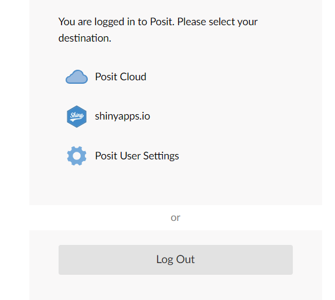
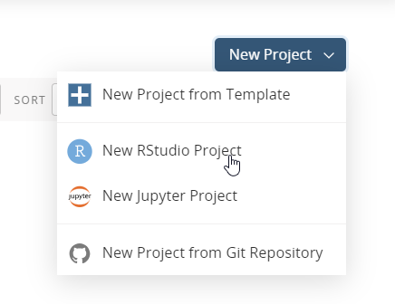
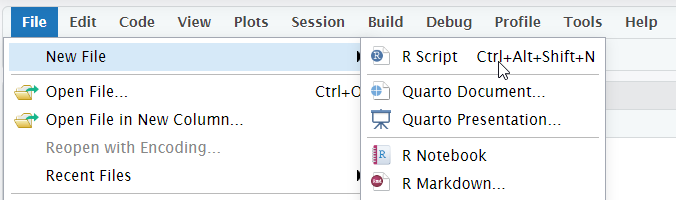

L'objectif de ce tutoriel est de vous introduire aux techniques de Process Mining en uitilisant les libraries open source [bupaR](https://bupar.net/) et [Process Analytics](https://process-analytics.dev/).

**bupaR** est une suite de packages R destinée à l'analyse des données d'exécution de processus. Elle offre des fonctionnalités pour manipuler, visualiser et analyser les données d'exécution de processus à l'aide de R.

**Process Analytics** est un projet open source initié par Bonitasoft qui vise à développer des libraries de visualisation des données d'exécution en utilisant le standard BPMN. Dans ce tutoriel, nous allons utiliser la librarie [bpmnVisualizationR](https://github.com/process-analytics/bpmn-visualization-R/) (qui est aussi disponible en [Typescript](https://github.com/process-analytics/bpmn-visualization-js)).

## Environnement de développement

Nous allons utilisé la version en ligne de l'IDE Rstudio pour le lanage de programmation R.

* Allez sur https://login.rstudio.cloud/. 
* Crééz un compte (vous pouvez vous connecter avec votre compte Google ou GitHub).
* Séléctionnez **Posit Cloud**.
  
* Créez un nouveau projet **R** dans votre espace de travail. Nommez le **process-mining-introduction**
  
* Créez un nouveau fichier **R** en allant dans `File -> new File -> R script`
  


## Installation de bupaR et de Process Analytics
Pour installer une librarie en **R** qui est disponible sur [CRAN](https://cran.r-project.org/) (CRAN est une plateforme qui contient des logiciels, de la documentation et des extensions sous forme de packages pour le langage de programmation R), il suffit d'appeler `install.packages()`.

### Installation de bupaR
`bupaR` fournit un esemble de packages. Pour installer les packages pincipaux du projet, nous allons installer `bupaverse`. Pour utiliser les algorithmes de prédiction de bupaR, il fait installer le package `processPredictR`.

```r
install.packages("bupaverse")
install.packages("processpredictR")
```

### Installation du package bpmnVisualizationR du projet Process Analytics
Le projet Process Analytics fournit un ensemble de packages de visualisation à base de BPMN. Dans ce tutoriel, nous allons utiliser le package `bpmnVisualizationR`.

```r
install.packages("bpmnVisualizationR")
```

## Importation des données d'exécution du processus de demande de prêt
Commençons par importer les données et jeter un premier coup d'œil. Nous allons importer les données stockées dans un fichier CSV à partir de GitHub.

```r
url <- "https://raw.githubusercontent.com/Bonitasoft-Community/bonita-camp-fstm/master/processmining-handson/loan-app-process-data.csv"
data <- read.csv(url(url))
```

## Transformation des données en un format adéquat à bupaR
L'attribut `loanID` représente le `caseID` en process mining. Pour faciliter donc notre analyse, nous allons renommer `loanID` en `case_id`. Nous allons aussi renommer les attributs `startTime` et `completeTime` en `start` et `complete`.

```r
library(dplyr)
process_data <- process_data %>% dplyr::rename(case_id = loanID,
                 start = startTime,
                 complete = completeTime)
```
Ensuite, nous allons fixer le format des attributs de timestamps pour qu'on puisse utiliser les fonctions de bupaR.
```r
library(bupaR)
process_data <- proceess_data %>% convert_timestamps(columns = c("start", "complete"), format = ymd_hms)
```

Nos données ne continnent pas l'attribut `Actor` qui précise quel acteur a exécuté quelle activité. En process mining en général ce n'est pas grave car `Actor` n'est pas considéré parmi les attributs obligatoires. Cependant, les algorithmes de bupaR imposent un format au données et ont besoin de la présence de l'attribut `Actor` même si ce dernier n'est pas utilisé. Pour cela, nous allons simplement ajouté un attribut `Actor` qui a la valeur `NA` partout.

```r
process_data <- process_data %>% mutate(Actor = NA)
```

Finalement, nous allons appeler le fonction `activityLog` de `bupaR` qui va transformer notre dataframe en un object `activityLog` qui est accepté en entrée par les algorithmes implémentés dans bupaR.

```r
process_data_log <- process_data %>% activitylog(case_id = "loanID",
              activity_id = "activity",
              resource_id = "Actor",
              timestamps = c("start", "complete"))
```
## Exploration basique des données
Commençons par comprendre les bases de nos données de processus :

```r
print(process_data_log %>% n_activities)
print(process_data_log %>% n_activity_instances)
print(process_data_log %>% n_cases)
```

Nous pouvons également explorer les instances de processus exécutées :

```r
process_data_log %>% trace_explorer(coverage = 1)
```

Pour viualiser la longueur des traces:
```r
process_data_log %>%
  trace_length("log") %>%
  plot

```

Pour comprendre à quelle fréquence chaque activité se produit :
```r
process_data_log %>% activities
```

## Découverte automatique de processus
Nous allons découvrir un process sous format de **process maps**. Les process maps sont des représentations non formelles des processus qui servent à la visualisation.
```r
process_data_log %>%
    process_map(frequency("absolute"))
```
`bupaR` ne fournit pas des algorithmes de découverte basés sur BPMN. Nous allons donc importer un processus BPMN (que nous avons découvert avec un autre outil appelé [ProM](https://promtools.org/) et qui est utilisé dans le monde de recherche) et le visualiser avec le package `bpmnVisualizationR` de Process Analytics. Voici les étapes à suivre:

* Allez à: https://raw.githubusercontent.com/Bonitasoft-Community/bonita-camp-fstm/master/processmining-handson/loan-app-diagram.bpmn
* Sauveguarder le contenu du diagramme BPMN dans un fichier nommé **loan-app-diagram.bpmn**.
* Téléchargez le fichier **loan-app-diagram.bpmn** dans votre environnement **R**.
* Visualisez le diagramme en utilisant `bpmnVisualizationR`:

```r
library(bpmnVisualizationR)
bpmn_file <- "loan-app-diagram.bpmn"
bpmnVisualizationR::display(bpmn_file)
```

Pour visualiser la fréquence des activités sur le BPMN, nous allons calculer les fréquences des activités avec **bupaR** et ensuite les visualiser sur le BPMN en utilisant **bpmnVisualizationR**.

Copiez ce code qui stocke les activités du BPMN et leur ids dans une dataframe.
```r
activity <- c("Start1", "Request a loan", "Validate loan request", "Review loan request", "Notify refusal", "Write loan contract", "Sign contract", "Notify expiracy", "Validate contract", "Credit funds")
activity_id <- c("_1rDBIAFVEe699a762ILRaQ", "_sQoQMAgbEe6jMYUrrhrEhg", "_z6MpoAgbEe6jMYUrrhrEhg", "_4nCMMAgbEe6jMYUrrhrEhg", "_BwPMYAgcEe6jMYUrrhrEhg", "_ZnPdwAgcEe6jMYUrrhrEhg", "_cIX9wAgcEe6jMYUrrhrEhg", "_fa6skAgcEe6jMYUrrhrEhg", "_j092AAgcEe6jMYUrrhrEhg", "_oc0K4AgcEe6jMYUrrhrEhg")
bpmn_activities <- data.frame(activity, activity_id)
```
ensuite, calculez les fréquences d'exécution des activités avec **bupaR**:
```r
activities_frequencies <- process_data_log> %>% activity_frequency("activity")
View(activities_frequencies)
```
Finalement, visualizez les fréquences sur votre BPMN en utilisant **bpmnVisualizationR**:
```r
overlays <- list()
for(i in 1:nrow(activities_frequencies)){
  activity_name <- activities_frequencies$activity[i]
  activity_id <- bpmn_activities$activity_id[bpmn_activities$activity==activity_name]

  freq <- activities_frequencies$absolute[i]
  overlay = bpmnVisualizationR::create_overlay(activity_id, as.character(freq))
  overlays <- c(overlays, overlay)
}

bpmnVisualizationR::display(bpmn_file, overlays)
```
Vous pouvez changer le style de l'overlay:
```r
style <- bpmnVisualizationR::create_overlay_style(
  font_color = 'WhiteSmoke',
  font_size = 19,
  fill_color = 'blue',
  stroke_color = 'blue'
)
```

## Analyse de performance
```r
process_data_log %>%
    process_map(performance(mean, "days"))
```

Pour visualiser le temps moyen de traitement des cas:
```r
process_data_log %>% processing_time("case", units = "hours") %>%
  plot()
```

Pour visualiser le temps d'attente entre les activités:
```r
process_data_log %>% 
  process_matrix(performance(FUN = mean, units = "hours", flow_time = "idle")) %>%
  plot()
```

## Animation
L'animation des données sur le processus peut fournir une représentation visuelle des chemins parcourus par les traces. D'abord, installez le package par `install.packages("processanimateR)`.

```r
library(processanimateR)
event_log <- to_eventlog(process_data_log)
animate_process(event_log)
animate_process(event_log, mapping = token_aes(color = token_scale("red")))
```

## Prédiction
### Préparation des données

```r
library("processpredictR")
process_data_for_prediction <- prepare_examples(process_data_log, task = "outcome")
View(process_data_for_prediction)
```

### Division des données
Ensuite nous allons diviser notre jeu de données en 2 partie: une partie qui va être utiliser pour entrainer le réseau de neurone  (ensemble d'entraînement) et une autre pour évaluer la précision du modèle appris (ensemble de test).
```r
split <- process_data_for_prediction %>% split_train_test(split = 0.8)
View(split$train_df)
View(split$test_df)
```

### Construction du modèle prédictif
Nous utiliserons un modèle de réseau neude neurones pour la prédiction. Les étapes de prétraitement, telles que la tokenisation des séquences, la normalisation des caractéristiques numériques, etc., se déroulent au sein de la fonction `create_model()` et sont abstraites pour l'utilisateur.

```r
library(tensorflow)
library(keras)
model <- split$train_df %>% create_model(name = "mon_premier_modele_predictif_de_resultat")
```

### Entraînement
```r
model %>% compile()
hist <- model %>% fit(object = model, train_data = split$train_df, epochs = 5)
print(hist$metrics)
```


